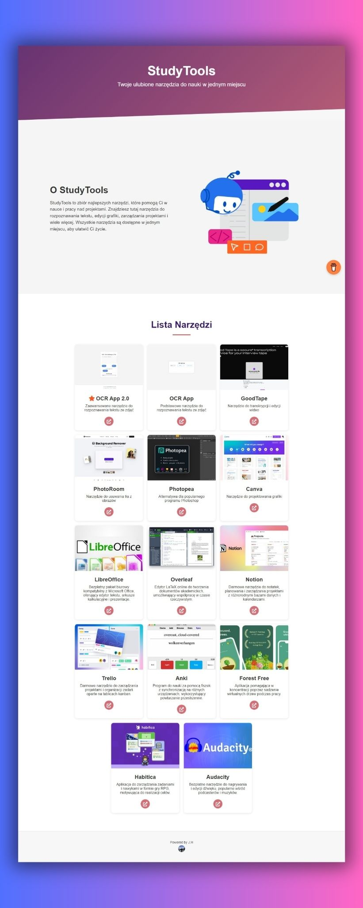

# StudyTools

StudyTools to aplikacja webowa, która agreguje różne narzędzia przydatne dla studentów w jednym miejscu. Strona jest responsywna i wielojęzyczna.

## Funkcje

- Lista narzędzi edukacyjnych z opisami i linkami do aplikacji
- Podział narzędzi na kategorie
- Responsywny design dostosowany do urządzeń mobilnych
- Obsługa wielojęzyczności (polski i angielski)
- Popup z dodatkowymi informacjami o narzędziu, kategorią, obrazem i informacją o cenie
- Animowane gradienty i elementy strony

## Używane technologie

- HTML5
- CSS3
- JavaScript
- Font Awesome (ikony)

## Wsparcie

Jeśli chcesz wesprzeć moją pracę, możesz to zrobić przez [Buy me a coffee](https://www.buymeacoffee.com/Jacob22092).

